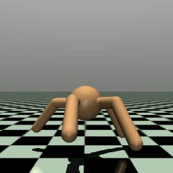
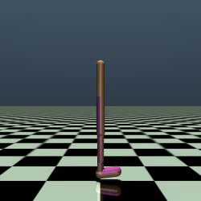
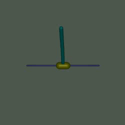
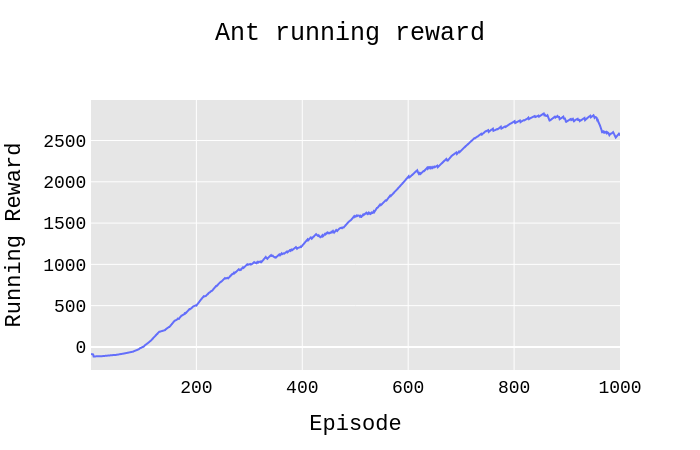
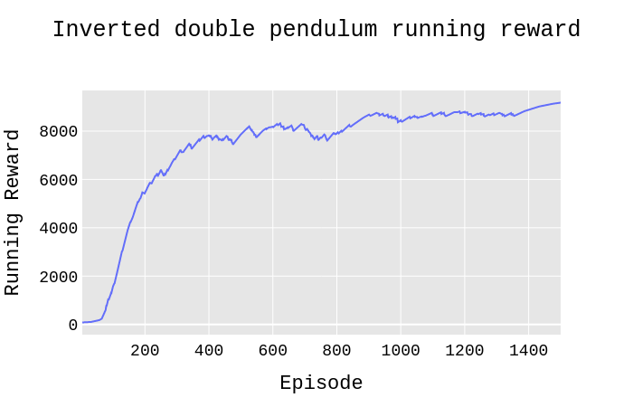

# Continuous-PPO
[](http://makeapullrequest.com)  
Implementation of the proximal policy optimization on Mujoco environments. All hyper-parameters have been chosen based on the paper.
> For Atari domain. [look at this](https://github.com/alirezakazemipour/Proximal-Policy-Optimization).  

## Demos
Ant-v2| Walker2d-v2| InvertedDoublePendulum-v2
:-----------------------:|:-----------------------:|:-----------------------:|
| | 

## Results
Ant-v2| Walker2d-v2| InvertedDoublePendulum-v2
:-----------------------:|:-----------------------:|:-----------------------:|
| | 

## Dependencies
- gym == 0.17.2
- mujoco-py == 2.0.2.13
- numpy == 1.19.1
- opencv_contrib_python == 3.4.0.12
- torch == 1.4.0

## Installation
```shell
pip3 install -r requirements.txt
```
## Usage
```bash
python3 main.py
```
- You may use `Train_FLAG` flag to specify whether to train your agent when it is `True` or test it when the flag is `False`.  
- There are some pre-trained weights in _pre-trained models_ dir, you can test the agent by using them; put them on the root folder of the project and turn `Train_FLAG` flag to `False`.


## Environments tested
- [x] Ant
- [x] InvertedDoublePendulum
- [x]  Walker2d
- [ ]  Hopper
- [ ]  Humanoid
- [ ]  Swimmer
- [ ]  HalfCheetah  

## Reference
[_Proximal Policy Optimization Algorithms_, Schulman et al., 2017](https://arxiv.org/abs/1707.06347)  

## Acknowledgement
- [@higgsfield](https://github.com/higgsfield) for [his ppo code](https://github.com/higgsfield/RL-Adventure-2/blob/master/3.ppo.ipynb).  
- [@OpenAI](https://github.com/openai) for [Baselines](https://github.com/openai/baselines). 
- [@Reinforcement Learning KR ](https://github.com/reinforcement-learning-kr) for their [Policy Gradient Algorithms](https://github.com/reinforcement-learning-kr/pg_travel).
